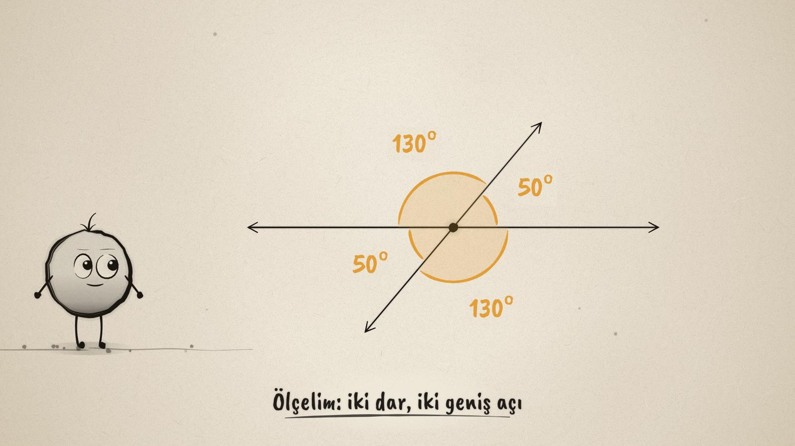
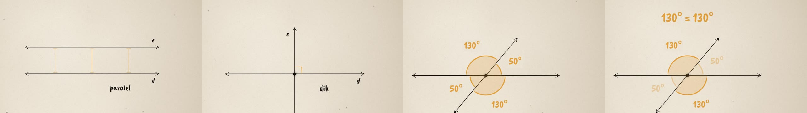

# Doğrular Kesişince · When Lines Cross

**▶ Tarayıcıda izleyin / Watch in the browser:** https://hakanatas.github.io/dogrular-kesisince/ 
**⬇ MP4 + altyazılar / MP4 + subtitles:** [Releases](https://github.com/hakanatas/dogrular-kesisince/releases) 
**✎ Kullanılan istem / The prompt behind it:** [PROMPT.md](PROMPT.md)

> **TR —** 5. sınıf matematik "Geometrik Şekiller" temasındaki MAT.5.3.4 öğrenme çıktısı için hazırlanmış, tamamen JavaScript ile çizilen 92 saniyelik mürekkep animasyonu. Nokta iki doğru çiziyor; doğruların paralel, çakışık, kesişen ve dik durumlarını gösteriyor. Sonra kesişen doğruların oluşturduğu dört açıyı önce tahmin edip sonra ölçüyor: ters açılar eştir, komşu açılar bütünler (180°) olabilir, dik açıyı bölen iki açı tümlerdir (90°). Altyazılar Türkçe, İngilizce ya da ikisi birlikte seçilebilir.

A 92-second ink animation for **5th-grade maths**, drawn entirely with JavaScript on an HTML5 canvas. It is the third film in the geometry series, after [Noktadan Çembere](https://github.com/hakanatas/noktadan-cembere) (MAT.5.3.1–5.3.2) and [Kaç Derece?](https://github.com/hakanatas/kac-derece) (MAT.5.3.3). Nokta, the ink character from [The Learning Ink](https://github.com/hakanatas/the-learning-ink), is the guide again.

## Learning outcome

MEB, Türkiye Yüzyılı Maarif Modeli, Ortaokul Matematik, 5th grade, "Geometrik Şekiller" theme:

**MAT.5.3.4. Düzlemde iki veya üç doğrunun birbirine göre durumuna bağlı olarak oluşabilecek açılara dair çıkarım yapabilme**
- a) … oluşabilecek açılara dair varsayımlarda bulunur.
- b) … oluşan açıları belirleyerek listeler.
- c) Belirlediği açıları varsayımlarıyla karşılaştırır.
- ç) … oluşan açılara dair önerme sunar.
- d) Sunduğu önermelerin, doğruların oluşturduğu açıların incelenmesine yönelik katkısına dair gerekçe sunar.

The program introduces the terms *kesişen, dik, paralel, çakışık doğrular; ters açılar, komşu açılar, tümler, bütünler*. Its example conclusion is: "İki doğrunun kesişiminde iki dar ve iki geniş açı veya dört dik açı meydana geliyor."

The film follows the outcome's order: **guess → list → measure → compare → state a rule**.

## Designed to be easy to follow

- One idea per scene, with a single short caption on screen at a time.
- The same colour rule as *Kaç Derece?*: **black ink = lines**, **amber = a measurement**.
- Opposite angles share an arc radius, so pairs that are equal also look alike.
- Before any number appears, the angles are numbered 1–4 and Nokta asks "which ones are equal?", leaving time for a class guess.
- The rule is tested by turning the line: the numbers change live, but opposite angles stay equal.

## Scenes

| # | Time | Scene | What happens | Outcome |
|---|---|---|---|---|
| 1 | 0–8 s | İki doğru | Nokta is born from a drop of ink and draws two lines, **d** and **e**. | Intro |
| 2 | 8–19 s | Paralel, çakışık | e sits above d; three amber markers show the same distance everywhere, so the lines are **parallel**. Then e slides down onto d, making them **coincident**. | 5.3.4 · positions of two lines |
| 3 | 19–30 s | Kesişen, dik | e turns and meets d at one point, so the lines are **intersecting**. At 90° they are **perpendicular**. | 5.3.4 · positions of two lines |
| 4 | 30–46 s | Dört açı | The crossing makes four angles, numbered 1–4. First a guess ("which ones are equal?"), then the measurement: 50°, 130°, 50°, 130°. That is two acute and two obtuse angles. | 5.3.4 a, b, c |
| 5 | 46–62 s | Ters açılar | The angles facing each other are **vertical angles**. e turns to 35° and 70°, and the pairs stay equal. Rule: **ters açılar eştir**. | 5.3.4 ç, d |
| 6 | 62–78 s | Komşu açılar | Angles side by side with one shared arm are **adjacent angles**. 50° + 130° = 180°, so they are **bütünler** (supplementary). A ray splits a right angle into 30° + 60° = 90°: **tümler** (complementary). | 5.3.4 ç, d |
| 7 | 78–92 s | Aklında kalsın | "Ters açılar eş, komşu açılar 180°." Nokta celebrates. | Wrap-up |

Kept for a later lesson: two parallel lines cut by a third line (*keseni*) and the eight angles it makes.

## Running it

- **Preview:** double-click `index.html` (it works offline). Controls: play/pause, timeline, scene jump, speed, 16:9 or 9:16, and captions Off / TR / EN / TR+EN.
- **MP4:** run `npm install` once, then `npm run export -- --format=horizontal --captions=tr`.
- **Subtitles and narration:** `npm run srt` writes `out/captions_*.srt` and `narration_notes.txt`.
- **Editing:**
  - Caption text, timings and narration notes: `captions.js`
  - Scenes: `scenes/scene1.js` … `scene7.js`
  - How line e moves over time (`phi`, `off`), the four angles and Nokta's poses: `src/draw/film.js`
  - Layout for 16:9 and 9:16: `src/draw/kd.js`

It uses the same engine as The Learning Ink: `renderFrame(t)` as a pure function of time, seeded randomness, and frame-by-frame export.
